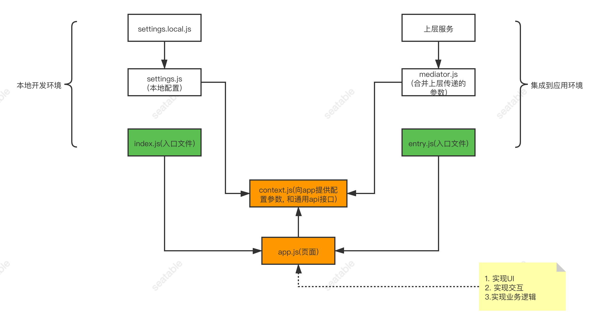
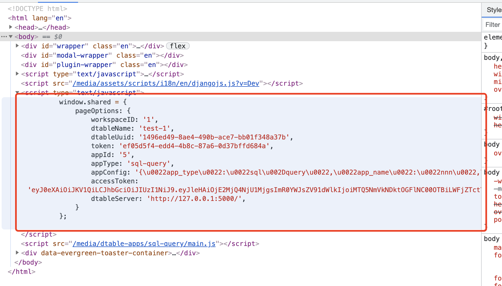

# SeaTable app template

## 目录结构

```
build ------------------------------------ 项目编译后的文件夹
config ----------------------------------- 项目编译配置文件夹
public ----------------------------------- 项目本地开发静态文件文件夹
scripts ---------------------------------- 项目打包脚本
src -------------------------------------- 项目源码文件夹
   api ----------------------------------- 访问服务端的接口文件
   locale -------------------------------- 项目国际化支持文件夹
     lang -------------------------------- 语言文件夹
     index.js ---------------------------- 国际化语言支持入口文件
   pages --------------------------------- 页面模块
   utils --------------------------------- 常用工具函数
   app.js -------------------------------- 项目主代码
   context.js ---------------------------- 管理全局参数及dtable-web相关api
   entry.js ------------------------------ app在集成环境下的入口文件
   index.js ------------------------------ 开发环境下入口文件
   mediator.js --------------------------- app集成环境下配置文件
   setting.js ---------------------------- 开发环境下配置文件
   setting.local.dist.js ----------------- 本地开发环境配置文件样例
   setting.local.js ---------------------- 本地开发环境下配置文件 (从样例拷贝后再修改)
```
## 代码层次及相关作用

### 代码结构图
> 本地开发及集成开发中全局变量的构建及管理



如上图: 
1. 开发环境中用到的变量通过 setting.local.js 文件进行配置
2. 部署环境中用到的变量通过 mediator.js 统一收集所有 app 需要的配置信息(由上层应用提供)
3. 通过 context 工具类对上层传递的配置信息进行统一管理, 向 app 提供统一的获取接口
4. app 的开发只需从 context 提供的 api 中获取相关配置信息, 无序考虑不同环境下配置信息的获取问题
5. app 内部各模块的开发根据需求及设计进行处理

## 集成步骤

1. 完成翻译任务
```
   1) 将本地需要翻译的内容放入 `/public/local/en/**.json` 文件中
   2) 执行 `npm run push-translate` 将需要翻译的文件提交到翻译平台
   3) 在翻译平台 https://www.transifex.com/ 上完成支持语言的翻译工作
   4) 执行 `npm run pull-translate` 将翻译好的内容从翻译平台拉取下来
```

2. 完成打包工作, 执行 `npm run build`
3. 将打包好的文件放入 dtable-web 项目
```
   1) copy 打包好的文件 main.css, main.js(打包好的文件在 build 文件夹下)
   2) paste 到 dtable-web 项目 /media/dtable-apps/**/ 文件夹下
```

4. 更新配置文件
```
对 dtable-web 项目 /media/dtable-apps/ 文件夹下的 config.json 进行更新
添加新的 app 的配置文件
{
   "app_name": "app-name",
   "app_type": "app-name",
   "version": "0.0.1",
   "display_name": {
      "de": "",
      "en": "app-name",
      "fr": "",
      "zh-cn": ""
   },
   "description": {
      "de": "",
      "en": "the app's description",
      "fr": "",
      "zh-cn": ""
   }
}
```

## 开发流程

第一步: 本地全局安装 create-seatable-app 脚手架
`npm install create-seatable-app -g`

第二步: 创建 app 项目
`create-seatable-app init **`

第三步: 配置 app 项目
1. 在 dtable-web 项目中更新 app 配置文件, 添加需要创建 app 的配置信息(app 展示列表从该文件中读取内容)
```
对 dtable-web 项目 /media/dtable-apps/ 文件夹下的 config.json 进行更新
添加新的 app 的配置文件
{
   "app_name": "app-name",
   "app_type": "app-name",
   "version": "0.0.1",
   "display_name": {
      "de": "",
      "en": "app-name",
      "fr": "",
      "zh-cn": ""
   },
   "description": {
      "de": "",
      "en": "the app's description",
      "fr": "",
      "zh-cn": ""
   }
}
```
2. 在 app 管理界面创建一个新 app 的实例
3. 访问 app 实例, 会打开一个空白的页面, 打开 “开发者工具”, 进入 Elements 选项卡
4. 找到 scripts 标签内部, 可以发现包含 app 开发的相关的配置信息  

1. 更新本地配置信息, 运行项目, 可以看到 template 项目能够正常运行

第二步: 开发 app 项目
1. 基于需求及设计按步骤进行开发
2. 合理划分组件及目录结构
3. 按照模块进行开发

## 注意事项

### 参数添加
当 app 需要新的参数时, 
1. 需要更新 setting.local.js 文件满足开发环境的需要
2. 需要更新 mediator.js 文件满足部署环境的需要

### 国际化

国际化的使用请异步 ➡️[react-intl-universal](https://github.com/alibaba/react-intl-universal)